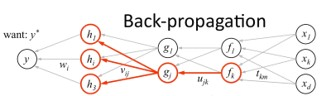
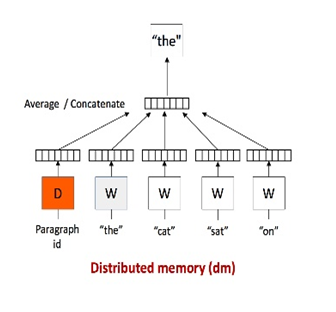
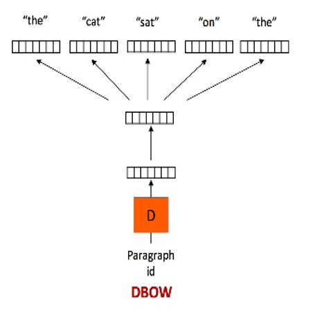

# Purpose
- 기존 문서 카피 추출 시스템은 글의 구조가 다르고 내용적인 의미에서는 유사한 두 문서 간의 비교를  수행했을 때 유사성을 추출해내지 못한다는 단점에 기반하여, 이를 해결하기 위한 시스템을 제안하였다.

# Class
1. doc2vec 
- 여러 개의 문서들로 부터 많은 word data를 얻고 이 data에 대해 back propagation과 stochastic gradient descent를 이용해 얻어진 gradient를 통해 model을 학습시킨다. 모든 문서들의 word vector는 공유되며 doc2vec은 이 얻어낸 word vector들을 down sampling하고 이 안에서 topic vector를 추출해내어 문서의 대표 벡터를 추출해 낸다. model을 training 시키는 원리는 word2vec에 기반한다.
2. word2vec 
- 같은 맥락을 지닌 단어는 가까운 의미를 지니고 있다는 전제에서 출발한다. 따라서, 핵심 아이디어는 단어의 동시 발생 빈도 (co-occurrence)가 된다. 단어의 의미를 벡터형태로 표현하는 계량 기법이다. 텍스트 문서를 통해 학습을 진행하며 한 단어에 대해 근처에 출현하는 다른 단어들을 관련 단어로써 neural network에 학습시킨다. 연관된 의미의 단어들은 문서 가까운 곳에 출현할 가능성이 높기 때문에 학습을 반복해 나가는 과정에서 두 단어는 점차 가까운 벡터를 지니게 된다.

# Algorithm
1. Stochastic gradient descent : training data가 많을 수록 계산이 오래 걸릴 수 있는데 이를 해결하기 위해 등장한 방법이다. batch gradient descent 알고리즘은 전체 training data를 선택해 사용하지만, stochastic gradient descent 알고리즘은 무작위로 data를 선택해서 그 data를 통해 전체 기울기를 추정하여 전자의 알고리즘보다 더 빠르게 최소 기울기를 추산해 낸다.
2. Backpropagation : Multi-layer neural network에서 가장 적절한 weight를 찾아내기 위해 실제 결과값과 추출된 output 사이의 차이에 대해 각 레이어의 output을 다시 이전 레이어로 보내 제대로 된 output이 나오도록 weight를 수정해 나가는 기법.

      
3. TF-IDF : 여러 문서로 이루어진 문서군이 있을 때 어떤 단어가 특정 문서 내에서 얼마나 중요한 것인지를 나타내는 통계적 수치이다. 특정 문서 내에서 단어 빈도가 높고 전체 문서들 중 그 단어를 포함한 문서가 적을수록 TF-IDF 값이 높아진다.

      TF : 
      IDF : 
      TF-IDF : 
4. Cosine Similarity : 내적 공간의 두 벡터간 각도의 코사인 값을 이용하여 측정된 벡터 간의 유사한 정도를 나타낸다.
        
5. DM(Distributed Memory) : 학습하고자 하는 단위 텍스트의 임베딩과 문맥 윈도우 내 다른 단어를 이용하여 목표 단어의 임베딩을 유추하고, 실제 단어의 임베딩과 유추한 임베딩 간의 오차를 줄이는 방향으로 학습한다.
       
5. DBOW(Distributed BOW) : 학습하고자 하는 단위 텍스트의 임베딩을 이용하여 문맥 윈도우 내에 포함되어 있을만한 단어를 유추하고, 실제 포함 단어와 유추한 단어 간의 오차를 줄이는 방향으로 학습한다. 해당 프로젝트에서는 DM모델보다 DBOW모델이 더욱 좋은 정확도를 보였기에 이를 사용하였다.
      

# Library(Python)
1. Gensim 
- https://insight.io/github.com/piskvorky/gensim/blob/develop/gensim/models/doc2vec.py
- https://radimrehurek.com/gensim/models/doc2vec.html

# Reference
- https://arxiv.org/pdf/1405.4053v2.pdf
- https://github.com/RaRe-Technologies/gensim/blob/develop/docs/notebooks/doc2vec-lee.ipynb
